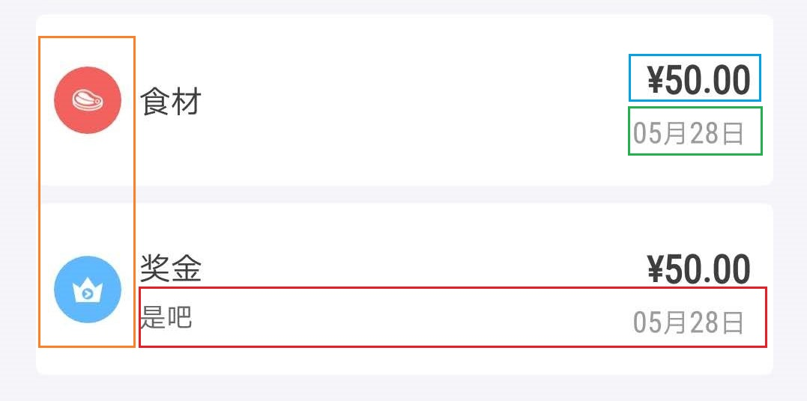

### 账目信息组件编写
这个组件要完成的是下面这张图的效果(先忽略用颜色框起来的部分)：<br /><br />


#### 组件的样式要求
<ul>
  <li> 组件左边图标部分颜色有两种状态
  <li> 组件中部和右部在只有一行字的状态下也可以水平居中
</ul>

#### 组件参数Props
```
export enum paymentType { //1-收入 2-支出
	Income = 1,
	Outcome = 2,
}
export interface IProps {
	id: number | string
	category: string //账目种类中文名 
	icon: keyof typeof IconType // IconType是Icon名的枚举，完整查看引入路径
	paymentType: paymentType
	moeny: string
	time?: number  // 取的时间戳
	formatMoney?: boolean
	note?: string
	onClick?: (id: number | string) => void
}
```
每一个数据又有一个唯一ID，这是必须的。<br />
paymentType 使用枚举类型，在判断时不容易犯错，同时也靠这个参数显示不同的图标颜色。其他的参数应该都能理解。

#### 组件PropTypes类型检查
这里在处理 <b>paymentType</b> 的类型检查时的处理方法可以参照 <a href="./part-02.md">part-02.md</a>举例的方法, <b>icon</b> 的类型检查目前的方法是引入一个进行了类型定义的数组。

#### 代码编写
页面和样式的还是比较简单的。传送门：<a href="./../src/components/AccountItem/index.tsx">账目信息组件</a> <br />
你可能注意到页面上的金额和时间都进行了格式化，下面几节介绍下工具函数的编写以及全局的函数声明。
