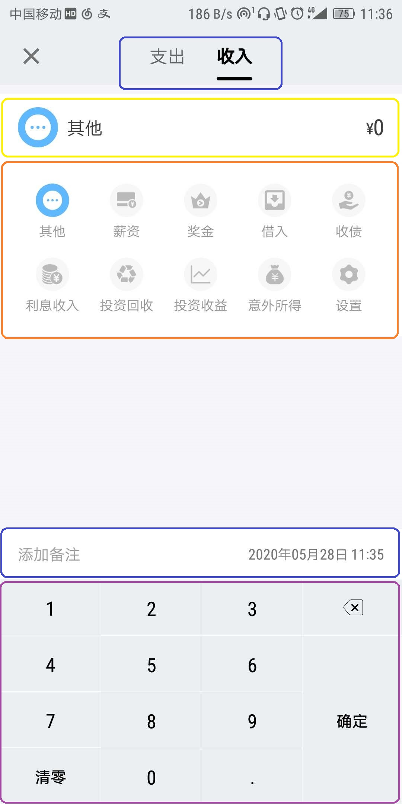

### <b>添加和修改页分析</b>
>首先建议可以先下载参考的App：我的记账本（体积很小的）看看页面的效果

首先看图分析下该页面情况：
  
添加和修改页大致可以分为5个部分：
<ul>
  <li>[蓝色] 头部收入、支出Tab组件</li>
  <li>[黄色] AccountItem账目组件（已有）</li>
  <li>[红色] 包裹 Icon 的 swiper 组件</li>
  <li>[深蓝色] 时间备注组件（这个其实不用抽离成组件）</li>
  <li>[紫色] 底部输入金额的 keyboard 组件</li>
</ul>

#### 1. [蓝色] 头部收入、支出Tab组件

组件要求：点击相应tab标题，页面可以切换不同的显示。激活的tab页字体加粗，底部有下划线。 
提高要求：滑动页面主体，页面也可切换，tab页状态可以联动

#### 2. [黄色] AccountItem账目Tab组件
 已有可以直接复用

#### 3. [红色] 包裹 Icon 的 swiper 组件

组件要求：
<ul>
  <li>传入icon相关的数据以每组10（其他数量也行）个进行渲染，可以自动进行 swiper 页面的分割</li>
  <li>根据不同的icon数据的类型使用不同的颜色进行标记</li>
  <li>组件不依赖父组件的状态、行为，自己可以进行状态改变，发生行为</li>
  <li>在某些情况下，组件可以使用父组件传入的数据，进行状态初始化</li>
</ul>
提高要求：通过一个可选的参数传入父组件的一个方法，swiper 接收并在发生行为时传达参数通知父组件，达到和其他组件联动的效果。

#### 4. [深蓝色] 时间备注组件
可以不抽离成组件，直接写，到时候会有个弹窗，弹窗可以封装成一个组件

#### 4. [紫色] 底部输入金额的 keyboard 组件
组件要求：每个按钮通过点击可以通过某种方式告知，获取其中的参数。要想做的更好，可以传入一个参数改变键盘的内容引入多种场景，这里就做这一种。 
有没有可以推荐的react手机组件，想mand-mobile那种的。

### <b>添加和修改页组装联动分析</b>
<ul>
  <li>进入该页面后，默认进入 <b>支出</b> 的Tab页，swiper 组件和 AccountItem 账目组件有一个默认状态，但分以下两种情况</li>
  <ul>
    <li>当我们进行添加操作时，AccountItem 组件金额为0，备注和时间这里不传参。我们约定AccountItem组件的图标默显示 swiper 组件包裹的额第一个图标，并且这个图标高亮。</li>
    <li>当我们进行修改操作时，AccountItem 和 swiper 组件都显示和高亮相应图标。</li>
  </ul>
  <li>点击 swiper 组件里的图标，可以切换图标高亮，并且AccountItem 组件的图标和类型名称可以跟随联动</li>
  <li>点击键盘后，AccountItem 组件的金额可以响应变化</li>
  <li>点击Tab 文字或者左右滑动页面，可以切换视图</li>
</ul>